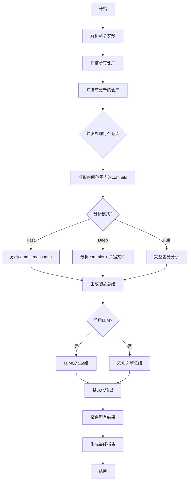

# RepoSense 代码更新总结功能设计文档

## 1. 功能概述

### 1.1 背景与动机

RepoSense 已经实现了高效的批量代码库更新功能，但仅知道哪些代码库有更新是不够的。开发者需要快速了解每个代码库的具体更新内容，以便：
- 跟踪关注的开源项目的最新进展
- 评估是否需要更新依赖版本
- 了解新功能和修复的问题
- 把握技术趋势和最佳实践

### 1.2 功能定位

新增 `reposense changelog` 子命令，用于生成指定时间范围内有更新的代码库的变更总结报告。该功能将：
- 自动识别有新提交的代码库
- 智能分析和总结更新内容
- 支持多语言总结输出
- 提供灵活的报告格式

## 2. 设计目标

### 2.1 核心目标
- **高效性**: 利用并发处理快速分析大量代码库
- **准确性**: 准确提取和总结关键更新信息
- **易用性**: 简单直观的命令行接口
- **灵活性**: 支持多种总结策略和输出格式
- **可扩展性**: 便于未来添加新的分析维度

### 2.2 非功能性需求
- 性能：能在合理时间内处理 100+ 个代码库
- 可靠性：单个代码库分析失败不影响整体执行
- 兼容性：支持各种 Git 工作流和提交规范
- 国际化：支持中文、英文、日文等多语言输出

## 3. 技术方案

### 3.1 总结策略比较

#### 3.1.1 基于 Commit Message 的总结

**优势：**
- 执行速度快，只需读取 git log
- 资源消耗小，不需要分析代码内容
- 信息密度高，commit message 通常包含关键信息
- 适合规范的项目（如遵循 Conventional Commits）

**劣势：**
- 依赖 commit message 质量
- 可能遗漏代码层面的重要变化
- 对不规范的提交信息效果差

#### 3.1.2 基于代码差分的总结

**优势：**
- 更准确地反映实际代码变化
- 不依赖 commit message 质量
- 可以识别重大架构变更
- 能分析具体的功能改动

**劣势：**
- 计算成本高，需要大量 diff 操作
- 可能产生过多噪音（如格式化、重构）
- 需要更复杂的 LLM 提示词
- API 调用成本更高

### 3.2 推荐方案：混合策略

采用**分层渐进式**的混合策略：

1. **快速模式**（默认）：基于 commit message
2. **深度模式**：commit message + 关键文件差分
3. **完整模式**：全量代码差分分析

```go
type AnalysisMode string

const (
    ModeFast    AnalysisMode = "fast"    // 仅 commit message
    ModeDeep    AnalysisMode = "deep"    // commit + 关键文件
    ModeFull    AnalysisMode = "full"    // 完整差分分析
)
```

## 4. 详细设计

### 4.1 命令行接口

```bash
# 基本用法：分析最近一天的更新
reposense changelog [directory]

# 指定时间范围
reposense changelog --since="2025-06-01" --until="2025-06-03"
reposense changelog --days=7  # 最近7天

# 指定分析模式
reposense changelog --mode=deep

# 指定输出语言和格式  
reposense changelog --language=zh --format=markdown

# 过滤特定仓库（使用现有的过滤系统）
reposense changelog --include="project-*" --exclude="*-test"

# 保存报告
reposense changelog --save-report --report-file=weekly-changelog.md

# 启用LLM增强总结（复用现有LLM配置）
reposense changelog --enable-llm --llm-provider=openai --llm-model=gpt-4
```

### 4.2 核心数据结构

```go
// ChangelogEntry 单个仓库的变更记录
type ChangelogEntry struct {
    Repository   scanner.Repository  // 复用现有的Repository结构
    TimeRange    TimeRange
    Commits      []Commit
    Summary      Summary
    Stats        ChangeStats
    UpdatedAt    time.Time
}

// Commit 提交信息（兼容git log输出）
type Commit struct {
    Hash      string    `json:"hash"`
    Author    string    `json:"author"`
    Date      time.Time `json:"date"`
    Message   string    `json:"message"`
    ShortMsg  string    `json:"short_message"`
}

// Summary 变更总结
type Summary struct {
    Title        string              // 一句话总结
    Highlights   []string            // 要点列表
    Categories   map[string][]string // 分类总结（features, fixes, docs等）
    Language     string              // 总结语言
    GeneratedBy  string              // 生成方式（rule-based或llm）
}

// ChangeStats 变更统计
type ChangeStats struct {
    CommitCount     int
    AuthorCount     int  
    FilesChanged    int
    Insertions      int
    Deletions       int
    MajorChanges    []string // 重大变更标识
}

// TimeRange 时间范围
type TimeRange struct {
    Since time.Time
    Until time.Time
}

// ChangelogReport 完整的变更日志报告
type ChangelogReport struct {
    TimeRange   TimeRange         `json:"time_range"`
    TotalRepos  int              `json:"total_repos"`
    UpdatedRepos int             `json:"updated_repos"`
    Entries     []ChangelogEntry `json:"entries"`
    GeneratedAt time.Time        `json:"generated_at"`
    Config      ChangelogConfig  `json:"config"`
}

// ChangelogConfig 分析配置
type ChangelogConfig struct {
    Mode          AnalysisMode `json:"mode"`
    Language      string       `json:"language"`
    EnableLLM     bool         `json:"enable_llm"`
    LLMProvider   string       `json:"llm_provider,omitempty"`
    LLMModel      string       `json:"llm_model,omitempty"`
}
```

### 4.3 处理流程



### 4.4 核心组件设计

#### 4.4.1 ChangelogAnalyzer

```go
// ChangelogAnalyzer 变更日志分析器
type ChangelogAnalyzer struct {
    scanner      *scanner.Scanner      // 复用现有扫描器
    llmService   *llm.DescriptionService // 复用现有LLM服务  
    reporter     *reporter.Reporter    // 复用现有报告器
    workers      int
    timeout      time.Duration
    logger       *logrus.Logger
}

// ChangelogOptions 分析选项
type ChangelogOptions struct {
    Directory       string
    Mode           AnalysisMode
    TimeRange      TimeRange
    Language       string
    EnableLLM      bool
    LLMProvider    string
    LLMModel       string
    IncludePatterns []string
    ExcludePatterns []string
    OutputFormat   reporter.ReportFormat
    SaveReport     bool
    ReportFile     string
    WorkerCount    int
    Timeout        time.Duration
}

// NewChangelogAnalyzer 创建新的分析器实例
func NewChangelogAnalyzer(opts ChangelogOptions) *ChangelogAnalyzer {
    // 初始化扫描器
    scannerInstance := scanner.NewScanner()
    
    // 初始化LLM服务（如果启用）
    var llmService *llm.DescriptionService
    if opts.EnableLLM {
        llmService = llm.NewDescriptionService(
            llm.Provider(opts.LLMProvider),
            opts.LLMModel,
            "", // API Key从环境变量读取
            "",
            opts.Language,
            opts.Timeout,
            true,
        )
    }
    
    // 初始化报告器
    reporterInstance := reporter.NewReporter(opts.OutputFormat, false)
    
    return &ChangelogAnalyzer{
        scanner:    scannerInstance,
        llmService: llmService,
        reporter:   reporterInstance,
        workers:    opts.WorkerCount,
        timeout:    opts.Timeout,
        logger:     logrus.New(),
    }
}

// Analyze 执行变更日志分析
func (a *ChangelogAnalyzer) Analyze(opts ChangelogOptions) (*ChangelogReport, error) {
    // 1. 扫描仓库（复用现有逻辑）
    repos, err := a.scanner.ScanDirectoryWithFilter(opts.Directory, opts.IncludePatterns, opts.ExcludePatterns)
    if err != nil {
        return nil, fmt.Errorf("扫描仓库失败: %w", err)
    }
    
    // 2. 筛选有更新的仓库
    updatedRepos := a.filterUpdatedRepos(repos, opts.TimeRange)
    
    // 3. 并发分析每个仓库
    entries := a.analyzeReposParallel(updatedRepos, opts)
    
    // 4. 生成完整报告
    report := &ChangelogReport{
        TimeRange:   opts.TimeRange,
        TotalRepos:  len(repos),
        UpdatedRepos: len(updatedRepos),
        Entries:     entries,
        GeneratedAt: time.Now(),
        Config: ChangelogConfig{
            Mode:        opts.Mode,
            Language:    opts.Language,
            EnableLLM:   opts.EnableLLM,
            LLMProvider: opts.LLMProvider,
            LLMModel:    opts.LLMModel,
        },
    }
    
    return report, nil
}
```

#### 4.4.2 CommitAnalyzer

```go
type CommitAnalyzer struct {
    conventionalCommit bool
    languageDetector   *LanguageDetector
}

func (ca *CommitAnalyzer) AnalyzeCommits(commits []Commit) *CommitAnalysis {
    return &CommitAnalysis{
        Features:     ca.extractFeatures(commits),
        Fixes:        ca.extractFixes(commits),
        Breaking:     ca.extractBreaking(commits),
        Dependencies: ca.extractDependencies(commits),
        Refactoring:  ca.extractRefactoring(commits),
    }
}
```

#### 4.4.3 DiffAnalyzer

```go
type DiffAnalyzer struct {
    ignorePatterns []string
    keyFileDetector *KeyFileDetector
}

func (da *DiffAnalyzer) AnalyzeDiff(repo Repository, since, until string) *DiffAnalysis {
    // 获取差分
    diff := da.getDiff(repo, since, until)
    
    return &DiffAnalysis{
        KeyFileChanges:   da.analyzeKeyFiles(diff),
        APIChanges:       da.detectAPIChanges(diff),
        ConfigChanges:    da.detectConfigChanges(diff),
        DependencyChanges: da.detectDependencyChanges(diff),
    }
}
```

### 4.5 LLM 集成设计

```go
type ChangelogLLMEnhancer struct {
    provider LLMProvider
    model    string
    language string
}

func (e *ChangelogLLMEnhancer) EnhanceSummary(analysis *ChangelogAnalysis) (*Summary, error) {
    prompt := e.buildPrompt(analysis)
    response := e.provider.Complete(prompt)
    return e.parseSummary(response)
}

// 提示词模板示例
const changelogPromptTemplate = `
分析以下代码库在 {{.TimeRange}} 期间的更新内容：

仓库名称: {{.RepoName}}
提交数量: {{.CommitCount}}
主要提交信息:
{{range .Commits}}
- {{.Message}}
{{end}}

{{if .DiffAnalysis}}
关键变更:
{{.DiffAnalysis}}
{{end}}

请用{{.Language}}生成一份简洁的更新总结，包括：
1. 一句话概述（不超过50字）
2. 3-5个要点
3. 按类别分组的详细变更（功能/修复/性能/文档等）

输出格式要求为JSON。
`
```

### 4.6 输出格式设计

#### 4.6.1 Markdown 格式

```markdown
# RepoSense 代码库更新报告

**时间范围**: 2025-06-01 至 2025-06-03  
**扫描仓库**: 250 个  
**有更新仓库**: 23 个

## 更新概览

### 🔥 重大更新

#### kubernetes/kubernetes
> Kubernetes 1.29 发布：引入原生边缘计算支持和 AI 工作负载优化

- ✨ 新增 EdgeNode 资源类型，支持边缘节点管理
- 🚀 GPU 调度器性能提升 40%
- 🐛 修复了 15 个安全漏洞
- 📚 更新了中文文档

**统计**: 127 commits | 45 contributors | +12,450 -8,920 lines

---

### 📊 按类别统计

| 类别 | 仓库数 | 主要更新 |
|------|--------|----------|
| 🆕 新功能 | 12 | AI集成、性能优化、API增强 |
| 🐛 Bug修复 | 18 | 安全修复、稳定性改进 |
| 📚 文档 | 8 | API文档、使用指南更新 |
| 🔧 维护 | 15 | 依赖更新、代码重构 |
```

#### 4.6.2 JSON 格式

```json
{
  "report": {
    "timeRange": {
      "since": "2025-06-01T00:00:00Z",
      "until": "2025-06-03T23:59:59Z"
    },
    "statistics": {
      "totalRepos": 250,
      "updatedRepos": 23,
      "totalCommits": 892,
      "totalAuthors": 234
    },
    "entries": [
      {
        "repository": "kubernetes/kubernetes",
        "summary": {
          "title": "Kubernetes 1.29 发布：引入原生边缘计算支持",
          "highlights": [
            "新增 EdgeNode 资源类型",
            "GPU 调度器性能提升 40%",
            "修复 15 个安全漏洞"
          ],
          "categories": {
            "features": ["EdgeNode support", "AI workload optimization"],
            "fixes": ["Security patches", "Scheduler bugs"],
            "docs": ["Chinese documentation update"]
          }
        },
        "stats": {
          "commits": 127,
          "authors": 45,
          "insertions": 12450,
          "deletions": 8920
        }
      }
    ]
  }
}
```

## 5. 性能优化

### 5.1 并发策略
- 使用 goroutine 池处理多个仓库
- 每个仓库的分析在独立 goroutine 中执行
- 实现背压控制，防止内存溢出

### 5.2 缓存机制
- 缓存 LLM 生成的总结（基于 commit hash）
- 缓存仓库元数据
- 实现增量分析模式

### 5.3 资源限制
- 限制同时分析的仓库数量
- 设置单仓库分析超时
- 实现内存使用监控

## 6. 错误处理

### 6.1 容错设计
- 单个仓库失败不影响整体
- Git 操作失败自动重试
- LLM 调用失败降级到规则引擎

### 6.2 错误分类
```go
type ChangelogError struct {
    Type     ErrorType
    Repo     string
    Message  string
    Cause    error
    Retryable bool
}

const (
    ErrorTypeGit      ErrorType = "git"
    ErrorTypeLLM      ErrorType = "llm"
    ErrorTypeAnalysis ErrorType = "analysis"
    ErrorTypeTimeout  ErrorType = "timeout"
)
```

## 7. 配置管理

### 7.1 命令行参数

| 参数 | 简写 | 默认值 | 描述 |
|------|------|--------|------|
| --since | -s | 24h ago | 开始时间 |
| --until | -u | now | 结束时间 |
| --days | -d | 1 | 最近N天 |
| --mode | -m | fast | 分析模式 |
| --language | -l | zh | 输出语言 |
| --format | -f | markdown | 输出格式 |
| --workers | -w | 10 | 并发数 |

### 7.2 配置文件支持

```yaml
# .reposense/changelog.yaml
changelog:
  defaultMode: deep
  defaultLanguage: zh
  timeRange:
    defaultDays: 7
  analysis:
    includePatterns:
      - "*.go"
      - "*.py"
    excludePatterns:
      - "vendor/*"
      - "node_modules/*"
  llm:
    provider: openai
    model: gpt-4
    temperature: 0.3
```

## 8. 测试策略

### 8.1 单元测试
- CommitAnalyzer 的提交信息解析
- DiffAnalyzer 的差分分析
- Summary 生成逻辑

### 8.2 集成测试
- Git 操作的正确性
- LLM 集成的稳定性
- 并发处理的正确性

### 8.3 性能测试
- 大规模仓库的处理能力
- 内存使用情况
- API 调用优化

## 9. 实施计划

### Phase 1: 基础功能
- 实现基本的 commit 分析
- 支持 fast 模式
- 基础的 Markdown 输出

### Phase 2: 高级分析
- 实现 deep 和 full 模式
- 集成 diff 分析
- 添加统计信息

### Phase 3: LLM 集成
- 集成现有 LLM 框架
- 优化提示词
- 实现缓存机制

### Phase 4: 优化完善
- 性能优化
- 错误处理完善
- 文档和测试

## 10. 总结

`reposense changelog` 功能将极大提升开发者追踪多个代码库更新的效率。通过智能分析和灵活的输出格式，帮助用户快速掌握代码库的最新动态。该设计充分考虑了性能、可扩展性和用户体验，与 RepoSense 的整体架构保持一致。